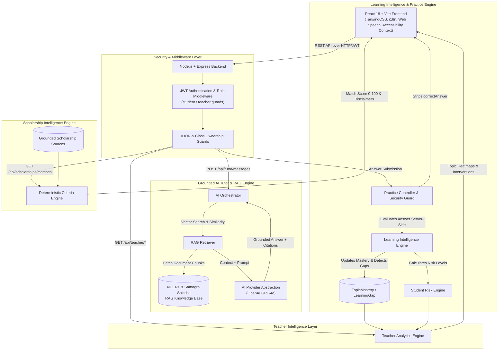

# BharatEdu AI - Architecture & Data Flow Diagram

Comprehensive end-to-end architecture diagram showing student learning activity, grounded RAG doubt solving, adaptive practice, teacher intelligence, and scholarship matching.

---

## High-Level Architecture Diagram



---

## Data Flow Sequences

### 1. Grounded Doubt Solving Flow
```
Student Question ──> AI Orchestrator ──> RAG Retriever ──> NCERT Document Chunks ──> LLM Prompt ──> Grounded Answer + Source Citations
```

### 2. Adaptive Practice & Gap Detection Flow
```
Student Answer ──> Server-Side Evaluation ──> TopicMastery Update ──> Learning Gap Rule Check ──> Adaptive Next Question Difficulty Step
```

### 3. Teacher Risk & Intervention Flow
```
Learning Gaps + Mastery ──> Deterministic Risk Engine ──> At-Risk Signal ('high'/'critical') ──> Intervention Recommendation Card
```
