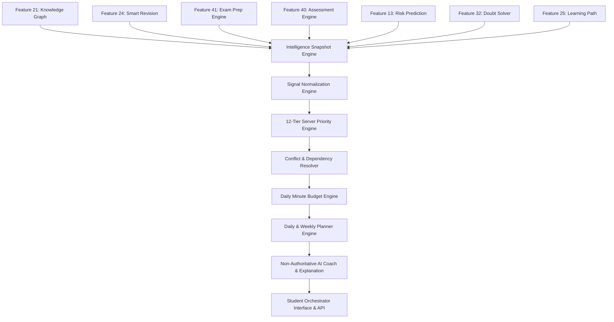

# Feature 43: AI Learning Orchestrator & Unified Student Intelligence Engine

## Architectural Summary
The **AI Learning Orchestrator** serves as the master coordination layer for BharatEdu AI. It answers the central question: *"What should this student do next?"* by dynamically synthesizing authoritative signals from across all 42 prior platform features.

## Core Specifications
1. **Server-Authoritative Decision Hierarchy**:
   Priority scoring, action dependency mapping, and schedule constraints are computed exclusively on the server. AI models explain and contextualize recommendations without directly mutating domain models (mastery, readiness, risk, scores, correctness, or revision intervals).
2. **Conflict Resolution & Budget Management**:
   Resolves conflicts between revision, new concepts, exam prep, doubt solving, and career goals while strictly respecting the student's daily minute budget.
3. **Role-Based Access & Privacy**:
   - **Student View**: Complete action plan, daily schedule, next best action, and progress tracking.
   - **Teacher View**: Aggregated class intelligence, common concept blockers, and intervention alerts.
   - **Parent View**: Verified child summary, current priorities, and recommended support without exposing private conversations.

## Data Models
- **`LearningOrchestration`** (`server/src/models/learning-orchestration.model.ts`): Stores overall orchestration status, top priorities, daily budget, daily/weekly plans, and execution history.
- **`OrchestrationAction`** (`server/src/models/orchestration-action.model.ts`): Stores individual action items, priority scores, estimated minutes, status (`recommended`, `started`, `completed`, `skipped`, `blocked`), and action URLs.

## API Endpoints
### Student Endpoints
- `GET /api/student/orchestrator` — Fetch current unified orchestration plan.
- `GET /api/student/orchestrator/today` — Fetch today's morning, afternoon, and evening schedules.
- `GET /api/student/orchestrator/week` — Fetch 7-day weekly focus roadmap.
- `GET /api/student/orchestrator/next` — Fetch single "Next Best Action".
- `GET /api/student/orchestrator/insights` — Fetch AI strategy insights.
- `POST /api/student/orchestrator/refresh` — Trigger plan recalculation.
- `POST /api/student/orchestrator/actions/:actionId/start` — Start an action.
- `POST /api/student/orchestrator/actions/:actionId/complete` — Mark action complete.
- `POST /api/student/orchestrator/actions/:actionId/skip` — Skip an action.

### Teacher Endpoints
- `GET /api/teacher/orchestrator` — Fetch class-wide aggregated orchestration intelligence.
- `GET /api/teacher/orchestrator/class/:classId` — Fetch specific class status.
- `GET /api/teacher/orchestrator/student/:studentId` — View authorized student orchestration.

### Parent Endpoints
- `GET /api/parent/orchestrator/student/:studentId` — View linked child orchestration status.
- `GET /api/parent/orchestrator/student/:studentId/today` — View linked child today plan.

## Verification & Testing
- Audit Script: `scratch/test_learning_orchestrator.js` (120 criteria verified)
- Server Build: `npm run build:server` (Passes with zero errors)
- Full Build: `npm run build` (Passes with zero errors)
- Full Regression: `scratch/test_full_regression.js` (Passes with zero errors)
