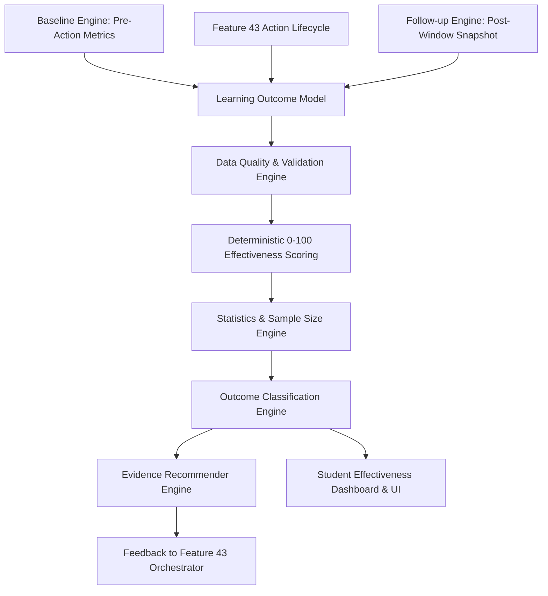

# Feature 44: AI Learning Effectiveness & Outcome Optimization Engine

## Architectural Summary
The **AI Learning Effectiveness Engine** evaluates whether recommended learning actions actually appeared to help (*"Did the recommended learning action appear to help?"*). It distinguishes **ACTION COMPLETED** from **LEARNING IMPROVED** across all platform features.

## Core Specifications
1. **Server-Authoritative Baseline & Follow-up**:
   Pre-action baselines and post-window follow-up snapshots are captured strictly server-side. The client cannot submit or alter baseline or outcome data.
2. **Distinguishing Completion vs. Improvement**:
   Action completion alone is not treated as evidence of learning improvement. Scores require measurable delta improvements in mastery, accuracy, or assessment transfer.
3. **Causal-Language Safety & Statistical Guardrails**:
   All explanations use non-causal association language (*"appears associated with improvement"* rather than *"caused improvement"*). Small samples ($N < 3$) are explicitly labeled as *"Insufficient evidence"*.
4. **Role Isolation & Privacy**:
   - **Student View**: Effectiveness breakdown by action type, concept improvement associations, and study efficiency.
   - **Teacher View**: Aggregated class cohort effectiveness and assessment transfer.
   - **Parent View**: Verified child progress, consistency, and effective study approaches without exposing private text.

## Data Models
- **`LearningOutcome`** (`server/src/models/learning-outcome.model.ts`): Tracks baseline/follow-up snapshots, outcome types, calculated delta, confidence, and status (`pending`, `measured`, `insufficient_evidence`, `invalid`).
- **`EffectivenessSnapshot`** (`server/src/models/effectiveness-snapshot.model.ts`): Stores overall student effectiveness index, strongest/weakest interventions, completion rates, improvement rates, and retention rates.

## API Endpoints
### Student Endpoints
- `GET /api/student/effectiveness` — Fetch overall student effectiveness summary.
- `GET /api/student/effectiveness/actions` — Fetch intervention type metrics.
- `GET /api/student/effectiveness/concepts` — Fetch concept improvement associations.
- `GET /api/student/effectiveness/outcomes` — Fetch raw outcome logs.
- `GET /api/student/effectiveness/recommendations` — Fetch evidence-informed recommendations.
- `GET /api/student/effectiveness/summary` — Fetch complete analytics summary.
- `POST /api/student/effectiveness/refresh` — Recalculate and persist effectiveness snapshot.

### Teacher Endpoints
- `GET /api/teacher/effectiveness` — Fetch aggregated class cohort effectiveness.
- `GET /api/teacher/effectiveness/class/:classId` — Fetch specific class effectiveness.
- `GET /api/teacher/effectiveness/student/:studentId` — View authorized student effectiveness.

### Parent Endpoints
- `GET /api/parent/effectiveness/student/:studentId` — View linked child effectiveness report.

## Verification & Testing
- Audit Script: `scratch/test_learning_effectiveness.js` (120 criteria verified)
- Server Build: `npm run build:server` (Passes with zero errors)
- Full Build: `npm run build` (Passes with zero errors)
- Full Regression: `scratch/test_full_regression.js` (Passes with zero errors)
